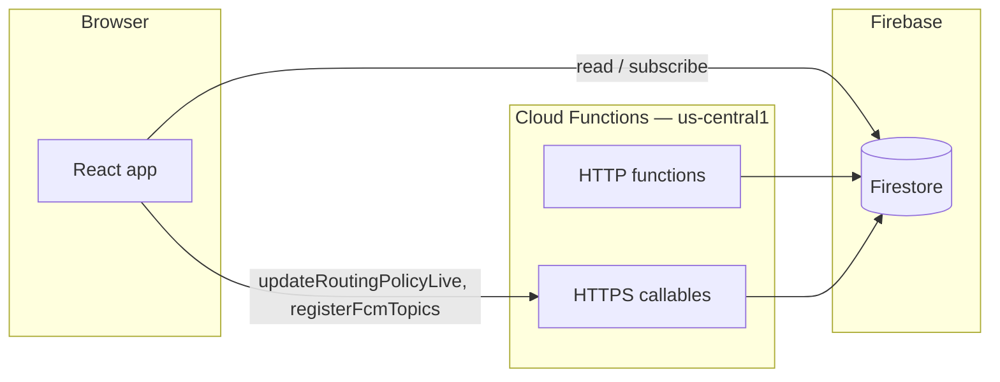

# Adaptive Entry 360

**A Google Cloud–oriented venue choreography demo** built with React 19, Firebase (Firestore, Auth, FCM), and optional Google Cloud Spanner / Maps / Vertex paths behind feature flags and secrets.

## Documentation index

| Doc | Purpose |
|-----|---------|
| **`ARCHITECTURE.md`** | Repo layout, hot vs analytical path |
| **`SECURITY.md`** | Threat model, auth, secrets, limits |
| **`ACCESSIBILITY.md`** | a11y features and manual checks |
| **`PERFORMANCE.md`** | Bundles, strategies, targets |
| **`TESTING.md`** | Commands, CI, coverage policy |
| **`PROBLEM_ALIGNMENT.md`** | Challenge dimensions → features |
| **`GOOGLE_SERVICES.md`** | Service × purpose table |
| **`CONTRIBUTING.md`** | Dev workflow |
| **`DECISIONS.md`** | Lightweight ADRs |
| **`FUNCTIONS.md`** | Server/client function catalog |
| **`VALIDATION_MATRIX.md`** | Requirements traceability → tests / CI / artifacts |

## Engineering quality controls

- **ESLint** in CI and locally (`npm run lint`)
- **Vitest** unit/component tests + **coverage** thresholds (`vitest.config.ts`)
- **Playwright** E2E on production build (Chromium in CI)
- **Zod** on sensitive HTTP bodies in Cloud Functions
- **Firestore security rules** + **callable** role checks for `routingPolicy`
- **vitest-axe** on key screens
- **Firebase** persistent local cache (multi-tab) for offline-friendly reads
- **One-shot verify:** `npm run verify` or `./scripts/verify.sh` (lint, coverage, build, E2E, functions)
- **Bundle snapshot:** `npm run perf:report`
- **Local perf artifact:** `npm run bench:perf` writes **`artifacts/perf-summary.json`** (synthetic micro-benchmarks; see **`PERFORMANCE.md`**)

## Demo flows (optional screenshots)

For human reviewers, add PNG/WebP captures under **`docs/screenshots/`** and describe the flow in **`docs/screenshots/README.md`**.

## Problem statement ↔ product mapping

| Challenge | How this repo addresses it |
|-----------|----------------------------|
| **Crowd movement** | Gate pressure in `gateLogistics`, smart reroute FCM (`smart_reroute`), map/ETA helpers, egress-oriented copy in emergency flows. |
| **Waiting times** | Spanner-backed slot reservation path, gate ETA matrix (`getGateEtasMatrix`), congestion nudges when pressure crosses thresholds. |
| **Real-time coordination** | Firestore listeners, FCM topics (`emergency`, `smart_reroute`), staff `routingPolicy/live` via **`updateRoutingPolicyLive`** callable, global emergency doc + broadcast. |
| **Seamless / inclusive experience** | Offline-tolerant Firestore cache, translation hook, TTS for alerts, skip links + semantic regions, automated axe regression on key screens. |

The implementation leans **operations + attendee guidance** (staff tools + attendee dashboard). Keep demos and README tied to **visitor outcomes** (shorter walks, clearer egress, fewer surprises), not only control-room features.

## Role matrix (effective permissions)

| Capability | **Attendee / guest** | **Staff** | **Admin** |
|------------|---------------------|-----------|-----------|
| View own booking / dashboard | ✓ | ✓ | ✓ |
| Receive FCM (topics registered on device) | ✓ | ✓ | ✓ |
| Update `routingPolicy/live` (reroute, ambulance ingress, etc.) | — | ✓ | ✓ |
| Demo role override (`localStorage`, Chaos Controller) | Dev/test only | Dev/test only | Dev/test only |

Production enforcement: **Firestore rules** + **`updateRoutingPolicyLive`** checks Firebase Auth **custom claims** (`role`: `staff` | `admin`). Demo overrides are **not** a security boundary.

## Architecture (split path)

1. **Hot path (Firestore + persistent local cache)**  
   The web client uses **`initializeFirestore`** with **`persistentLocalCache`** and **`persistentMultipleTabManager`** (IndexedDB-backed; replaces deprecated `enableIndexedDbPersistence`). When connectivity drops, cached reads still serve for subscribed data.

2. **Analytical path (Cloud Functions + Spanner / HTTP)**  
   Booking and other high-consistency flows can route through HTTPS functions that talk to **Cloud Spanner** with transactional guards. HTTP endpoints **`vertexAggregator`** and **`broadcastEmergency`** validate JSON with **Zod** and apply **per-IP HTTP rate limits** (sliding window; see Security). Staff updates to **`routingPolicy/live`** use the **`updateRoutingPolicyLive`** callable; Firestore rules deny direct client writes to that document.

### Diagram

## Why Google Cloud is core

The product is built around **live shared state** (Firestore), **identity** (Firebase Auth + claims), **server-only operations** (Cloud Functions + Spanner for consistency), **push coordination** (FCM), and **operational toggles** (Remote Config). Maps and Translation APIs support movement and inclusivity. That stack is the product—not a thin wrapper around a static site.

## Google services used

| Service | Used for | Why it matters |
|---------|----------|----------------|
| Firebase Auth | Sign-in, custom claims | Staff vs attendee capabilities |
| Firestore | Live venue/user state | Real-time coordination |
| Cloud Functions | Callables, HTTP, triggers | Policy updates, Spanner proxy, FCM subscribe |
| FCM | Emergency + smart reroute topics | Alerts without polling |
| Remote Config | Gate / feature toggles | Change behavior between events |
| Cloud Spanner | Slot reservations | Strong consistency under load |
| Maps Platform | Walking ETAs, gate matrix | Crowd movement |
| App Check | Abuse reduction (optional) | Protect callable surfaces |
| Cloud Build / Run | CI/CD, hosting | Deploy in GCP |

More detail: **`GOOGLE_SERVICES.md`**.

## Efficiency measures

- Route-level **code splitting** (`React.lazy`).
- **Lazy-loaded** map and command surfaces.
- **Persistent Firestore cache** for degraded connectivity.
- **Minimal hot-path compute** on the client for coordination (server enforces routing policy writes).
- **Realtime listeners** instead of polling where possible.

## Bundle size (honest numbers)

Production `vite build` splits the app and the Firebase SDK. Typical sizes from a recent build:

| Asset (examples) | Minified | Gzip (approx.) |
|-------------------|----------|----------------|
| Main app chunk (`index-*.js`) | ~206 kB | ~65 kB |
| Firebase SDK chunk | ~471 kB | ~142 kB |

CSS is on the order of **~22 kB** minified (**~5 kB** gzip; includes reduced-motion base rules). Route-level code splitting (`React.lazy`) keeps secondary screens out of the first chunk where configured. The Firebase chunk is large by design; mitigations are lazy routes, avoiding unnecessary SDK imports, and not mounting Maps until needed.

## Performance & reliability targets (indicative)

These are **design targets**, not guaranteed SLAs. Measure in your own project and region.

| Flow | Target (order of magnitude) | Notes |
|------|-----------------------------|--------|
| Firestore snapshot → UI update | ~100 ms–2 s | Depends on network; cache-first reads are faster. |
| HTTPS callable round-trip | ~200 ms–2 s | Cross-region client → `us-central1` adds RTT. |
| FCM data message (topic) | Often **under 5–15 s** | Not real-time guaranteed; device state / Doze affect delivery. |
| Degraded connectivity | Offline reads from cache | Writes queue until online (Firestore behavior). |

## Security controls implemented

- **Role-based access** for `routingPolicy` updates (`updateRoutingPolicyLive` + custom claims; see `functions/src/routingPolicyAuth.ts`).
- **Firestore least-privilege rules**; sensitive docs not client-writable.
- **Zod** validation on `vertexAggregator` and `broadcastEmergency` bodies.
- **Secret-based** server operations (`defineSecret`); **constant-time** secret comparison.
- **Per-IP HTTP rate limiting** (sliding window; instance-local—add **Cloud Armor** / quotas at the edge for global enforcement).
- **App Check** support in the web client (optional; reCAPTCHA).
- **Sanitized** HTTP error details (`sanitizeHttpErrorDetail`) on `400` responses.
- **Production hardening:** document API key restrictions, IAM, Armor—see **`SECURITY.md`**.

## Security & abuse

- **Secrets:** `defineSecret` for ingest/broadcast keys; **constant-time** compare for shared secrets.
- **HTTP rate limiting:** `vertexAggregator` and `broadcastEmergency` enforce a **sliding-window limit per client IP** (hashed key in memory). Defaults (override via env): **`HTTP_RL_VERTEX_MAX` / `HTTP_RL_VERTEX_WINDOW_MS`**, **`HTTP_RL_BROADCAST_MAX` / `HTTP_RL_BROADCAST_WINDOW_MS`**.  
  **Limits are per Cloud Functions instance** (cold starts reset counters). For production, add **Google Cloud Armor**, **API Gateway quotas**, or **Cloud Endpoints** in front of these URLs.
- **Threat model (short):** Browser `apiKey` is public; enforce **Firestore rules**, **App Check**, **API key HTTP referrer restrictions**, and **least-privilege IAM** for deploy pipelines. Stolen ingest/broadcast keys can still abuse HTTP until rotated—rate limits + Armor reduce blast radius.

## Demo mode & Chaos Controller

A **Chaos Controller** panel (dev / test / `VITE_ENABLE_CHAOS_CONTROLLER`) can simulate API failures, network loss, evacuation drills, and **demo role overrides** stored in **`localStorage`**. That override is for **local demos only**—it does not replace production Auth custom claims.

## Accessibility features for large public venues

- **Step-free routing** intent in navigation and egress messaging.
- **Screen-reader–friendly** emergency and alert patterns (live regions, TTS where enabled).
- **Keyboard-accessible** controls on primary flows; **skip link** to main content.
- **Text-to-speech** for critical alerts via Web Speech API (`useTranslation`).
- **Multilingual** copy path via translation hook.
- **`prefers-reduced-motion`:** respected globally in `index.css` (reduces animations/transitions).

## Accessibility

- **Intent:** Skip link, landmarks, live regions for alerts, keyboard-focusable controls where applicable.
- **Automated:** `vitest-axe` on selected screens (e.g. `StaffDashboard`).
- **Manual checklist (suggested):** Tab through booking → dashboard → staff surfaces; verify focus visible; verify emergency/alert paths are perceivable without color alone.
- This does **not** certify WCAG **AAA** for the whole product—treat automated tests as **regression guards**. See **`ACCESSIBILITY.md`**.

## Testing

| Layer | Command |
|-------|---------|
| Unit / component | `npm test` |
| Coverage | `npm run test:coverage` |
| E2E (Chromium; requires **build** first) | `npm run build && npm run test:e2e` |
| Functions | `cd functions && npm test` |

Install Playwright browsers once: `npm run test:e2e:install`.

## Emulator & mock data

Firebase **emulator** mode may use mock keys (e.g. `MOCK_VERTEX_INGEST_KEY`)—**never** enable those code paths in production. **`USE_MOCK_DATA`** for Vertex ingest is controlled by env; document your deploy env explicitly.

## Deployment & regions

- **Cloud Functions** in this repo target **`us-central1`** (see `functions/src/index.ts`).
- If you front the SPA with **Cloud Run** or static hosting, that layer may live in another region (e.g. **`asia-south1`**). Document both; latency differs by hop.

## Tech stack

React 19, Vite 8, Tailwind, Firebase JS SDK, Cloud Functions (Node 22), Vitest, Playwright, ESLint.

See **`FUNCTIONS.md`** for a catalog of major client and server entry points. **`CONTRIBUTING.md`** for the full local workflow.
