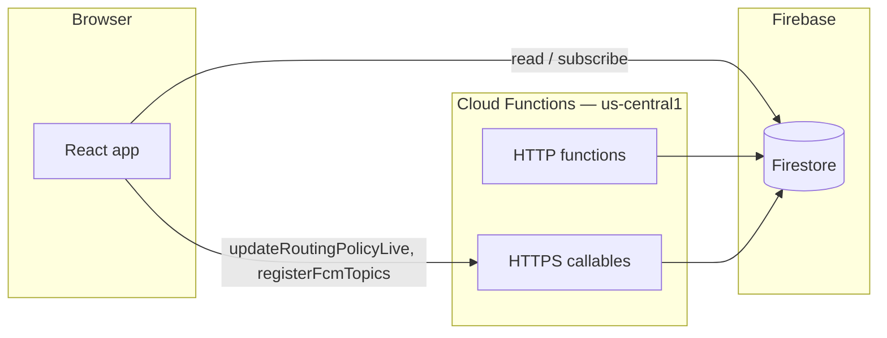

# Adaptive Entry 360

**A Google Cloud–oriented venue choreography demo** built with React 19, Firebase (Firestore, Auth, FCM), and optional Google Cloud Spanner / Maps / Vertex paths behind feature flags and secrets.

## Architecture (split path)

1. **Hot path (Firestore + IndexedDB)**  
   Primary sync uses Firebase with IndexedDB persistence where enabled. When connectivity drops, the client can lean on cached state for read-heavy flows.

2. **Analytical path (Cloud Functions + Spanner / HTTP)**  
   Booking and other high-consistency flows can route through HTTPS functions that talk to **Cloud Spanner** with transactional guards. HTTP endpoints such as **`vertexAggregator`** and **`broadcastEmergency`** validate JSON bodies with **Zod** before applying side effects.

Staff updates to **`routingPolicy/live`** (reroute flags, emergency vehicle ingress, etc.) go through the **`updateRoutingPolicyLive`** callable; Firestore security rules deny direct client writes to that document.

### Diagram (optional)

## Bundle size (honest numbers)

Production `vite build` splits the app and the Firebase SDK. Typical sizes from a recent build:

| Asset (examples) | Minified | Gzip (approx.) |
|-------------------|----------|----------------|
| Main app chunk (`index-*.js`) | ~206 kB | ~65 kB |
| Firebase SDK chunk | ~460 kB | ~139 kB |

CSS is on the order of **~22 kB** minified (**~5 kB** gzip). Route-level code splitting (`React.lazy`) keeps secondary screens out of the first chunk where configured.

## Demo mode & Chaos Controller

A **Chaos Controller** panel (dev / test / `VITE_ENABLE_CHAOS_CONTROLLER`) can simulate API failures, network loss, evacuation drills, and **demo role overrides** stored in **`localStorage`**. That override is for **local demos only**—it does not replace production Auth custom claims; remove it before judging real RBAC.

## Accessibility

The UI uses semantic structure, focus styles, and live regions where appropriate. **Automated checks:** `vitest-axe` runs on selected screens (see `src/pages/__tests__/StaffDashboard.a11y.test.tsx`). That does **not** certify WCAG **AAA** for the whole product; treat it as a regression guard, not a compliance sign-off.

## Performance notes

- **Lazy routes** reduce initial JS for paths you do not open immediately.
- **Firebase** is a separate chunk; first interactive load includes it when Auth/Firestore/Functions are used.
- **Maps / heavy panels** load with their routes; avoid loading the map on the critical path if you need a smaller first paint.

## Deployment & regions

- **Cloud Functions** in this repo target **`us-central1`** (see `functions/src/index.ts`).
- If you front the SPA with **Cloud Run** or static hosting, that layer may live in another region (e.g. **`asia-south1`**). Document both in your own infra README; latency differs by hop.

## Tech stack

React 19, Vite 8, Tailwind, Firebase JS SDK, Cloud Functions (Node 22), Vitest, ESLint.

See **`FUNCTIONS.md`** for a catalog of major client and server entry points.
